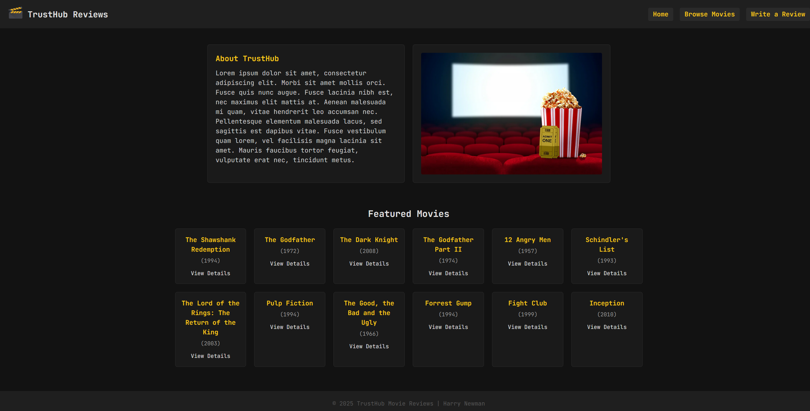

# TrustHub Movie Reviews Website

Explanation of how the TrustHub Movie Reviews site meets the assignment brief requirements.

---

## 1. Directories

```
trusthub/
  --> database.sql             # SQL schema for `movies` and `reviews` tables
  --> database_connect.php     # MySQLi connection script
  --> index.php                # Homepage, also shows featured movies
  --> movies.php               # Script for browsing all movies in the database
  --> movie.php                # Script for showing singular movie details & reviews
  --> submit_review.php        # Review submission form
  --> process_review.php       # Script for user review POST and insertion into database
css/
  --> global.css               # Global styling (navbar, footer, header, font, etc)
  --> homepage.css             # Homepage-specific styling (about section, movie cards, etc)
  --> movies.css               # Movies listing styling (movie cards, movie grid)
  --> review.css               # Review page styleing (form styling)
images/
  --> cinema_popcorn.jpg       # About us homepage image
  --> logo.jpg                 # Used in the navigation bar, all pages
  --> thank_you.png            # After a user submits a review, thank you image appears.
```

---

---

## 2. Meeting the Brief

The website meets the key requirements by:

1. **Multi-page structure** (LO3):
   - **index.php** (Homepage wireframe)
   - **movies.php** (Movies Listing page)
   - **movie.php** (Movie Details/Reviews)
   - **submit_review.php** & **process_review.php** (Review Submission flow)

2. **Database integration** (LO3):
   - **database.sql** defines `movies` and `reviews` tables
   - **database_connect.php** uses PHP’s MySQLi extension to connect
   - All pages include `database_connect.php` at the top to share one connection.

3. **Form handling & CRUD operations** (LO3):
   - Users select and submit ratings (1–5) and review text via `submit_review.php`.
   - `process_review.php` reads `$_POST`, escapes input with real_escape_string(), then inserts the review into the database.
   - Reviews are displayed on `movie.php`, satisfying the consumption and creation of data.

4. **Front-end layout & responsiveness** (LO2, LO3):
   - Separate CSS files to mimic "medium fidelity designs" (front-end) - (grid layouts, card styles, responsive breakpoints).
   - HTML structure supports accessibility and responsiveness.

5. **Security & best practice** (LO3):
   - Using `$_GET['id']` to `(int)` prevents SQL injection via URL parameters.
   - All user input in `$_POST` is secured with `real_escape_string()` before insertion. real_escape_string() is used to "escape" special characters in a string for safe use in SQL queries, preventing SQL injection. Adding backslashes before characters like single quotes ('), double quotes ("), backslashes (\), and others.
   - `htmlspecialchars()` is used to prevent XSS (cross-site scripting) attacks by removing special HTML characters, converting them into their HTML equivalents so they are rendered as text rather than executed as code. Converting characters like <, >, &, ", and ' into safe entities (e.g., &lt;, &gt;, &amp;, &quot;, &#39;).
   - `nl2br()` preserves line breaks in the user's input by converting newline characters (\n) into HTML <br> tags, ensuring text formatting is maintained.

---

